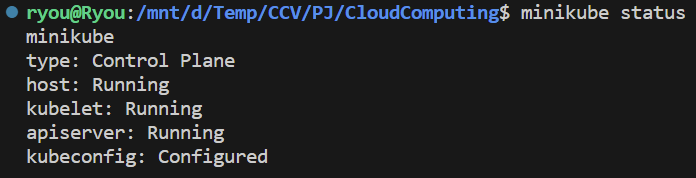
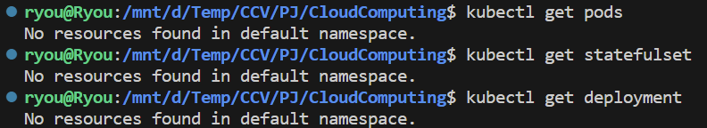
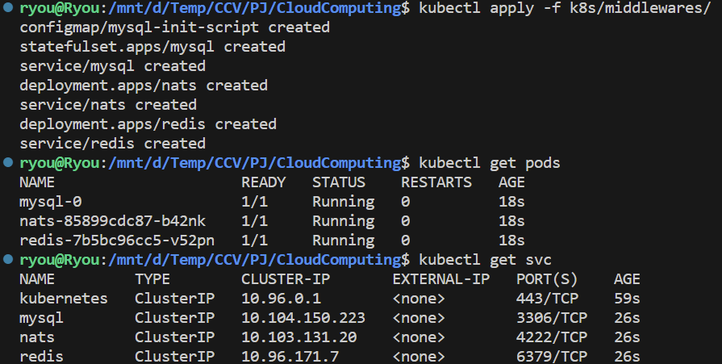
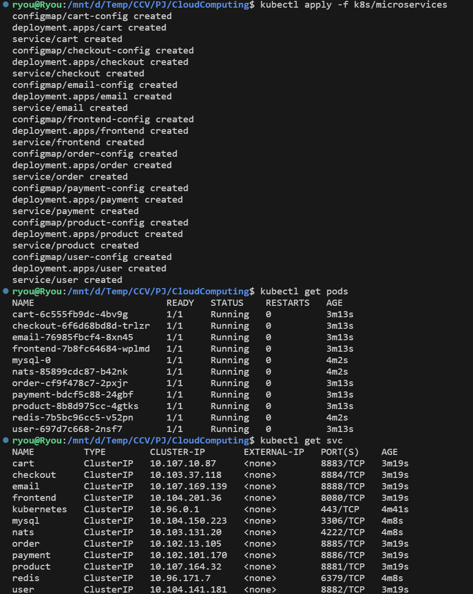
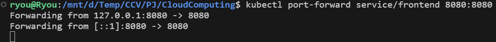
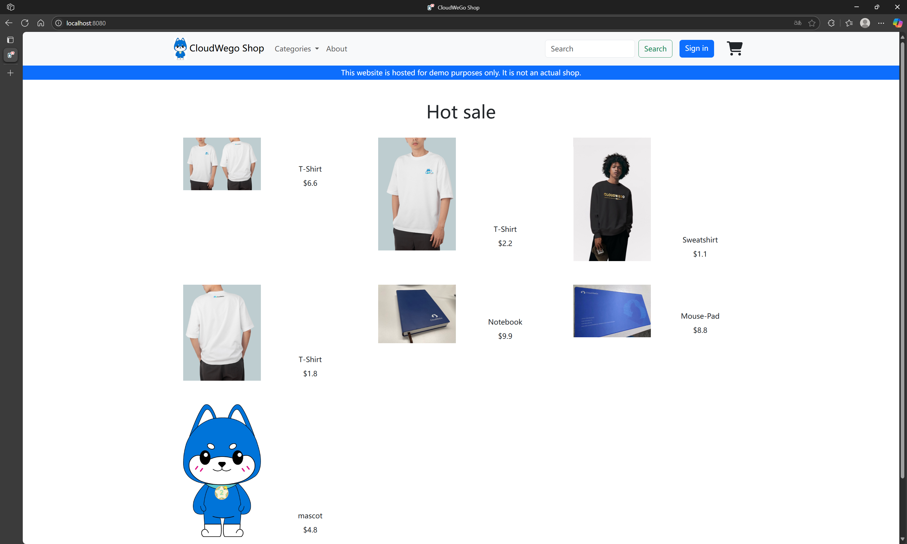
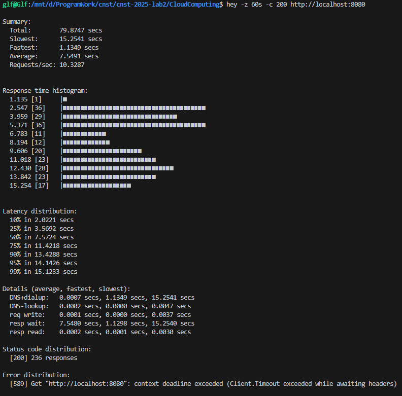
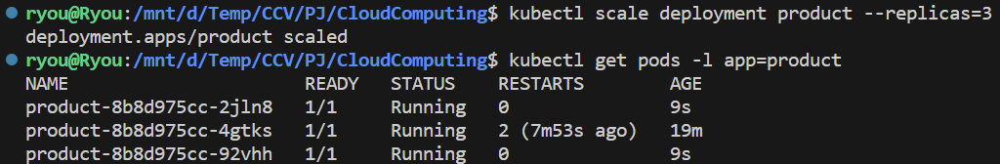
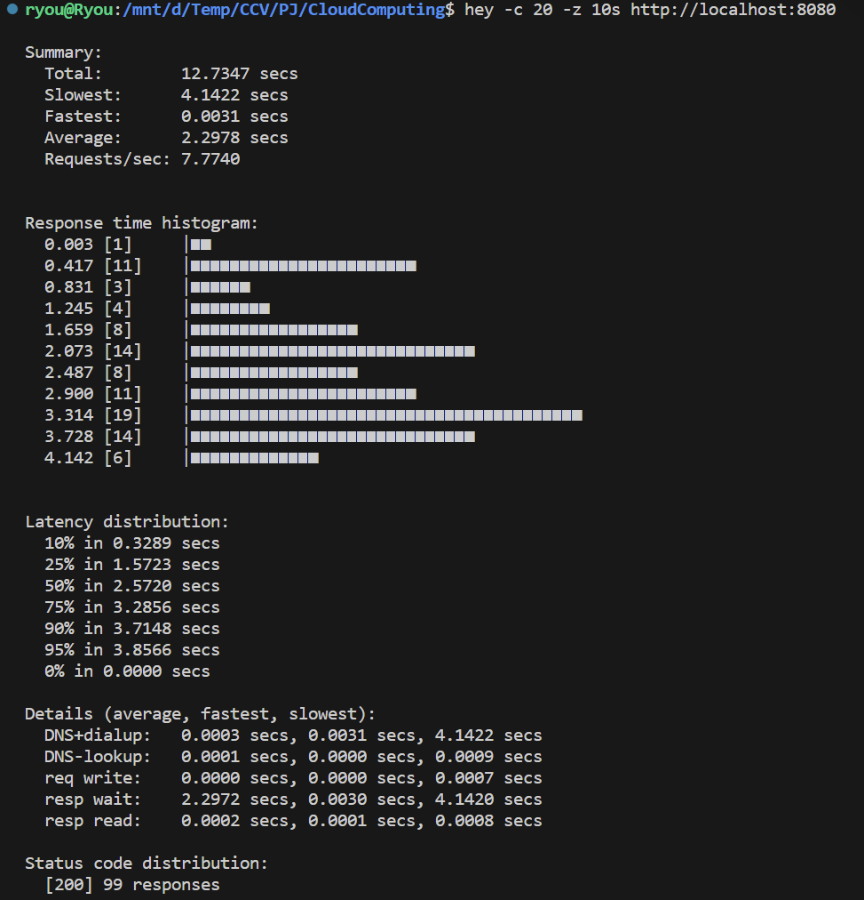
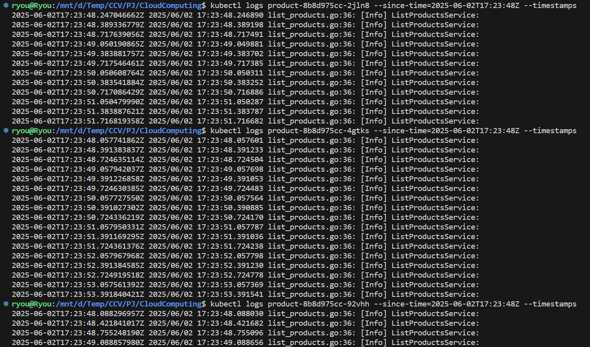

# 实验报告

## 一、为项目搭建 Kubernetes集群

使用git相关命令，拉取gomall项目。项目地址：https://github.com/cloudwego/biz-demo/tree/main/gomall

我们使用minikube搭建 Kubernetes集群。配置好对应环境，切换到非root用户，使用`minikube start`创建 Kubernetes 集群。使用`minikube status`，可以验证集群状态：



清除无用集群等：

## 二、部署中间件

在`gomall/k8s/middlewares`下，编写中间件对应的.yaml文件，其中，为MySQL服务创建ConfigMap保存init语句，解耦应用配置与镜像内容，使用StatefulSet管理有状态服务（MySQL），而nats、redis这些无状态中间件服务使用Deployment管理。

编写完成后，在 Minikube 中执行`kubectl apply -f gomall/k8s/middlewares/`应用所有 YAML 文件。

在控制台输入以下命令，应该可以看到类似如下的输出，验证中间件部署已成功：




## 三、部署gomall

在`gomall/k8s/microservices`下，编写每个微服务对应的`xxxx-configmap.yaml`、`xxxx-deployment.yaml`、`xxxx-service.yaml`文件。

其中值得注意的是，Deployment是通过调用ConfigMap将配置文件映射到Pod内的`/app/conf/dev/conf.yaml`处，直接替换原本镜像中的配置文件，因此有可能会对后续的实验步骤产生影响。例如在第四部分中助教对镜像中的`rate_limiter`进行了特殊设置，为了完成第四部分的实验，则也要相应修改`product-configmap.yaml`中的`rate_limiter`参数。

编写完成后，在 Minikube 中执行`kubectl apply -f gomall/k8s/microservices`应用所有 YAML 文件。

在控制台输入以下命令，应该可以看到类似如下的输出，验证各部分微服务部署已成功：



最后，使用`kubectl port-forward service/frontend 8080:8080`临时转发端口：



通过访问`http://localhost:8080`，即可看到该项目界面：

## 

## 四、扩缩容与负载均衡实验

在没有进行任何改动，即副本数为1的情况下，输入以下指令测试扩容前的响应时间、QPS等数据：



可以看到大部分请求的时长都达到了6.6s以上，并且只有52个成功请求。

输入`kubectl scale deployment product --replicas=3`对`product`服务进行扩容，即将副本数设置为3，并验证确实生成了新的副本：



再次进行压力测试：



可以看到许多请求的时长缩减到了2s左右，平均响应时间从5.0704s下降到了2.3017s，QPS从3.1796提升到了7.6042，成功请求数量从52个提升到了99个。

另外，输入以下指令查询`product`服务中各个pod的日志，检查负载均衡正常工作：

```
kubectl logs -l app=product --tail=100 --timestamps
```

如图可以发现每个副本中都有预期的`ListProductsService:`日志，说明流量已经成功分发到了多个Pod上，负载均衡正常工作：

