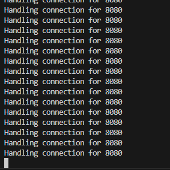
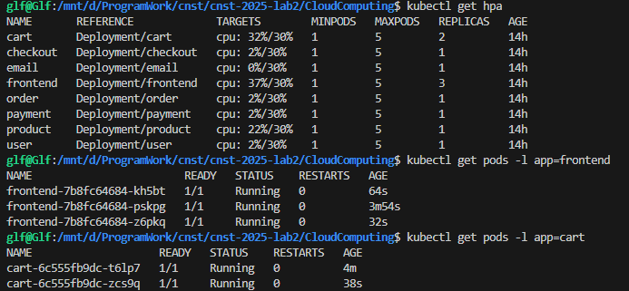
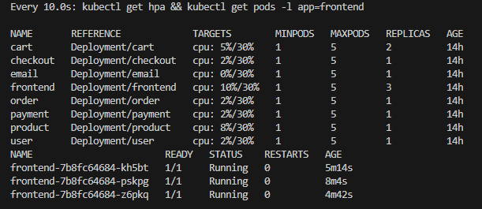
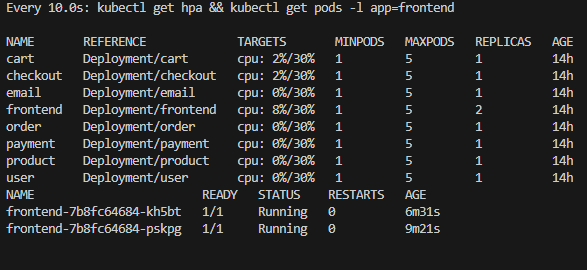
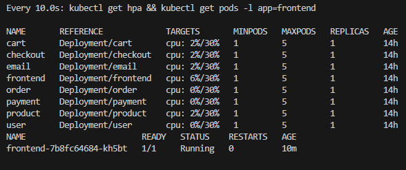

> ✅ **实现一个支持自动扩缩容（HPA）的微服务部署**，根据实时负载动态调整 Pod 副本数。
---
## ✅ 微服务自动扩缩容（HPA）实验步骤
---
### 📌 第一步：为目标服务部署指标采集组件（Metrics Server）
Kubernetes 的自动扩缩容依赖指标服务器（如 CPU 使用率），所以必须安装 Metrics Server。

---
我们将下载 `components.yaml` 并手动添加启动参数。
#### 1）下载文件到本地：
```bash
wget https://github.com/kubernetes-sigs/metrics-server/releases/latest/download/components.yaml -O metrics-server.yaml
```
#### 2）编辑文件，找到 `metrics-server` Deployment 段：
查找：
```yaml
containers:
  - name: metrics-server
    image: ...
    args:
      - --cert-dir=/tmp
      - --secure-port=4443
```
在 `args` 下添加一行参数：
```yaml
      - --kubelet-insecure-tls
```
在某些集群中（特别是 Minikube 或裸机），`kubelet` 使用了自签名证书，不被 Metrics Server 信任，所以需要这个参数绕过 TLS 校验。

---
### ✅ 步骤 3：重新应用安装
```bash
kubectl apply -f metrics-server.yaml
```
---
### ✅ 步骤 4：验证安装是否成功
等待十几秒后，执行：
```bash
kubectl get deployment metrics-server -n kube-system
kubectl top nodes
kubectl top pods
```
`metrics-server` 应该变成 `1/1 READY`，`top` 命令应返回数据。

---
### 📌 第二步：为目标服务设置资源请求与限制
以 `product` 服务为例，需确保其 Deployment 中包含资源限制字段：
#### ✏️ 修改 `product-deployment.yaml`
在 `containers` 下面添加：
```yaml
resources:
  requests:
    cpu: 100m
    memory: 128Mi
  limits:
    cpu: 500m
    memory: 256Mi
```
同理修改其他yaml文件之后一键重新部署：
```bash
kubectl apply -f k8s/microservices/
```
---
### 📌 第三步：创建 Horizontal Pod Autoscaler (HPA)
使用 CPU 利用率作为扩缩容依据。下面是一个示例命令：
```bash
kubectl autoscale deployment product --cpu-percent=50 --min=1 --max=5
```
此命令表示当 CPU 使用率超过 50% 时，`product` 服务会自动扩容，最多扩到 5 个 Pod。
你可以通过以下命令查看 HPA 状态：
```bash
kubectl get hpa
```
k8s下创建文件夹hpa，分别编写每个服务的hpa文件，再一键部署
```bash
kubectl apply -f k8s/hpa/
```
---
### 📌 第四步：制造负载以触发扩容
首先启动frontend服务并转发端口
```bash
kubectl port-forward service/frontend 8080:8080
```


使用 `hey` 进行压测：
```bash
hey -z 60s -c 200 http://localhost:8080
```
再查看副本数变化：
```bash
kubectl get hpa
kubectl get pods -l app=frontend
```
你应该能看到 `frontend` 的副本数自动增长。


---

### 📌 第五步：验证自动缩容

停止压测后执行监测：
```bash
watch -n 10 "kubectl get hpa && kubectl get pods -l app=frontend"
```




观察到 Pod 副本数减少至最小值1。

---
